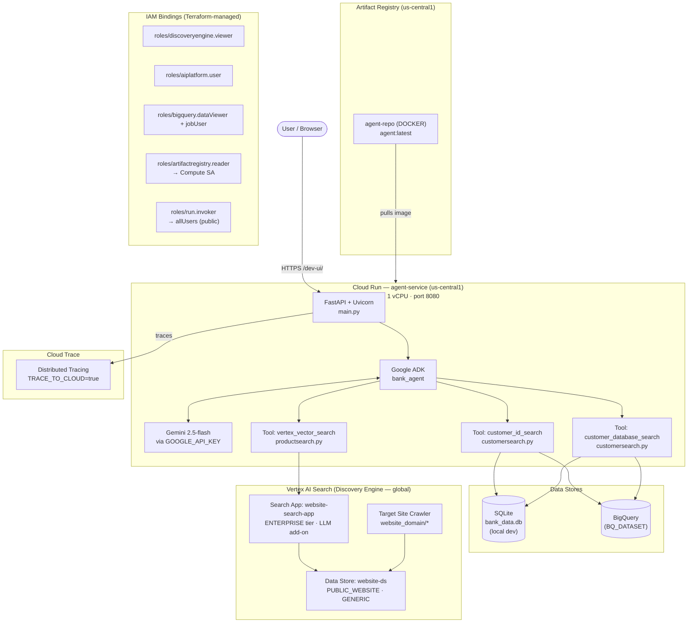

# Hackathon Starter

A starter template for building AI agents with [Google ADK](https://google.github.io/adk-docs/), Vertex AI Search, and BigQuery. It includes a vector search tool and a customer database tool — ready for you to wire into your own agent.

## Architecture



## What's Included

```
EDB-Hackathon-Starter/
└── ADKAgents/
    ├── bank_agent/
    │   ├── agent.py                # Your base agent — start here
    │   ├── prompt.py               # Agent instructions
    │   └── tools/
    │       ├── customersearch.py   # Customer lookup (BigQuery or SQLite)
    │       ├── productsearch.py    # Vertex AI vector search
    │       └── bigquery_tool.py    # General-purpose BigQuery query tool
    ├── bq_seed/                    # Seed data for the test BigQuery dataset
    │   ├── customers.json
    │   ├── accounts.json
    │   └── transactions.json
    ├── deploy/
    │   ├── main.tf                 # Terraform — provisions all GCP infrastructure
    │   ├── tf_deploy.py            # One-shot full deploy (infra + image + Cloud Run)
    │   ├── tf_run.py               # Terraform wrapper (passes .env as TF vars)
    │   ├── bq_deploy.py            # Creates BigQuery dataset + tables and loads seed data
    │   └── obliterate.py           # Destroy all Terraform-managed resources and reset state
    └── setup_env.py                # Interactive .env setup
```

## Prerequisites

- **Docker** - [https://www.docker.com/products/docker-desktop/](https://www.docker.com/products/docker-desktop/)
- **Python 3.14+** — [python.org/downloads](https://www.python.org/downloads/)
- **uv** — [docs.astral.sh/uv/getting-started/installation](https://docs.astral.sh/uv/getting-started/installation/)
- **Terraform** — [developer.hashicorp.com/terraform/install](https://developer.hashicorp.com/terraform/install) or `winget install HashiCorp.Terraform` on Windows
- **Google Cloud SDK** — [cloud.google.com/sdk/docs/install](https://cloud.google.com/sdk/docs/install)
- A Google Cloud project with billing enabled

---

## GCP Project Setup

### Create a project

```bash
gcloud projects create YOUR_PROJECT_ID --name="Your Project Name"
gcloud config set project YOUR_PROJECT_ID
```

### Enable billing

```bash
# List your billing accounts
gcloud billing accounts list

# Link one to the project
gcloud billing projects link YOUR_PROJECT_ID --billing-account=BILLING_ACCOUNT_ID
```

### Authenticate

```bash
gcloud auth login
gcloud auth application-default login
gcloud auth application-default set-quota-project YOUR_PROJECT_ID
```

### Get a Gemini API key

**Option A — AI Studio (personal use):** Visit [aistudio.google.com/apikey](https://aistudio.google.com/apikey) and create a key.

**Option B — via gcloud (project-scoped):**

```bash
gcloud services enable apikeys.googleapis.com generativelanguage.googleapis.com
gcloud services api-keys create \
  --display-name="Gemini API Key" \
  --api-target=service=generativelanguage.googleapis.com
```

The key string is printed in the output — copy it into `GOOGLE_API_KEY` in your `.env`.

### Create a service account (recommended)

```bash
gcloud iam service-accounts create terraform-deployer \
  --display-name="Terraform Deployer" \
  --project=YOUR_PROJECT_ID
```

Then set `MEMBER_EMAIL` in your `.env`:

```dotenv
MEMBER_EMAIL=serviceAccount:terraform-deployer@YOUR_PROJECT_ID.iam.gserviceaccount.com
```

Terraform will grant this identity the roles it needs during `tf-deploy`.

---

## Setup

### 1. Install dependencies

```bash
cd ADKAgents
uv sync
```

### 2. Authenticate with Google Cloud

```bash
gcloud auth login
gcloud auth application-default login
gcloud config set project {YOUR_PROJECT_ID}
```

### 3. Configure your environment

Run the interactive setup — it will write `bank_agent/.env`:

```bash
cd ADKAgents
uv run setup-env
```

You'll be prompted for:

| Variable | Description |
|---|---|
| `GOOGLE_API_KEY` | Gemini API key — get one at [aistudio.google.com/apikey](https://aistudio.google.com/apikey) |
| `GOOGLE_CLOUD_PROJECT` | Your GCP project ID |
| `GOOGLE_CLOUD_LOCATION` | GCP location (default: `global`) |
| `WEBSITE_DOMAIN` | Domain for Terraform to crawl (e.g. `www.example.com`) |
| `VERTEX_DATA_STORE_ID` | Leave blank for now — populated after Terraform deploy |
| `BQ_DATASET` | BigQuery dataset ID (leave blank to use local SQLite) |

### 4. Set up BigQuery data

The agent's customer search tools use BigQuery when `BQ_DATASET` is set in your `.env`. You have two options:

#### Option A — Deploy the included test dataset

The repo ships seed data (5 customers, 9 accounts, 19 transactions) in `bq_seed/`. One command creates the dataset, tables, and loads the data:

```bash
cd ADKAgents
uv run bq-deploy
```

This reads `GOOGLE_CLOUD_PROJECT` and `BQ_DATASET` from `bank_agent/.env`. If the dataset or tables already exist they are left in place; the seed load always truncates and reloads. Run it again at any time to reset the data to its original state.

#### Option B — Point to an existing BigQuery dataset

If you already have customer, account, and transaction data in BigQuery, set `BQ_DATASET` in `bank_agent/.env` to your dataset ID and leave it at that — no deploy step needed:

```dotenv
BQ_DATASET=your-existing-dataset-id
```

The agent expects three tables in that dataset with these column names:

| Table | Key columns |
|---|---|
| `customers` | `customer_id`, `name`, `dob`, `postcode`, `address`, `age`, `gender`, `phone` |
| `accounts` | `account_id`, `customer_id`, `product_type`, `balance` |
| `transactions` | `account_id`, `description`, `amount`, `type`, `date` |

If `BQ_DATASET` is left blank, both customer search tools fall back to a local SQLite file (`bank_data.db`) for development without any GCP dependency.

### 5. Deploy infrastructure

```bash
cd ADKAgents
uv run tf-deploy
```

This runs `terraform init` + `terraform apply`, builds and pushes your container image via Cloud Build, and deploys to Cloud Run. **Expect this to take around 10 minutes** on a fresh project. Once complete, your `VERTEX_DATA_STORE_ID` and Cloud Run URL are printed automatically.

Terraform provisions the following resources:

| Resource | Details |
|---|---|
| **Artifact Registry** | Docker repo for the agent container image |
| **Vertex AI Search** | Discovery Engine data store + enterprise search app |
| **Cloud Run** | Containerised agent service (2 GB RAM, us-central1) |
| **IAM bindings** | Deployer SA + Cloud Run compute SA granted required roles |

You can also run individual Terraform commands via the `tf` wrapper:

```bash
cd ADKAgents
uv run tf plan
uv run tf apply
uv run tf output -raw vertex_data_store_id
uv run tf destroy
```

#### Last resort: obliterate

If your deployment is in a broken state and you need to start completely from scratch, use:

```bash
cd ADKAgents
uv run obliterate
```

This will destroy **all** Terraform-managed GCP resources (Cloud Run service, Artifact Registry, Discovery Engine data store, IAM bindings), delete local Terraform state, and reset your `.env`. You'll be asked to type the project ID to confirm. The GCP project itself is kept — only the resources inside it are removed. After obliterating, run `uv run tf-deploy` to redeploy cleanly.

### 6. Run the agent locally

```bash
cd ADKAgents
adk web

# or, if you don't have `adk` installed globally
uv run adk web
```

---

## IAM Permissions

IAM roles are provisioned by Terraform alongside the data store. Set `MEMBER_EMAIL` in your `.env` file:

```dotenv
# ADKAgents/bank_agent/.env
MEMBER_EMAIL=user:you@example.com
# or for a service account:
# MEMBER_EMAIL=serviceAccount:sa@your-project.iam.gserviceaccount.com
```

`tf-deploy` reads this value automatically and passes it to Terraform as `TF_VAR_member_email`.

Terraform grants `roles/discoveryengine.viewer`, `roles/aiplatform.user`, `roles/bigquery.dataViewer`, and `roles/bigquery.jobUser` to that identity.

The Cloud Run compute service account is separately granted `roles/artifactregistry.reader` (to pull images) and `roles/bigquery.dataViewer` + `roles/bigquery.jobUser` (to query BigQuery at runtime).

---

## Building Your Agent

Open `ADKAgents/bank_agent/agent.py`. The agent is pre-configured with all three tools:

```python
from google.adk.agents import Agent
from .prompt import AGENT_INSTRUCTION
from .tools.customersearch import customer_database_search, customer_id_search
from .tools.productsearch import vertex_vector_search

root_agent = Agent(
    name="bank_agent",
    model="gemini-2.5-flash",
    description="A helpful banking assistant.",
    instruction=AGENT_INSTRUCTION,
    tools=[customer_id_search, customer_database_search, vertex_vector_search],
)
```

| Tool | Description |
|---|---|
| `customer_id_search` | Look up a customer by ID — uses BigQuery when `BQ_DATASET` is set, otherwise SQLite |
| `customer_database_search` | Full profile + transaction history for the verified customer |
| `vertex_vector_search` | Semantic search over your website via Vertex AI Search |

To build multi-agent pipelines, pass other `Agent` instances via `sub_agents=[...]`. Each sub-agent is invoked by name, and any inputs are forwarded as named keyword arguments matching its tool signatures.

---

## Deploy to Cloud Run

`uv run tf-deploy` automates the full sequence below. If the script fails partway through, you can run these steps manually from the `ADKAgents` directory:

```bash
# 1. Enable the Cloud Resource Manager API (required before Terraform can enable anything else)
gcloud services enable cloudresourcemanager.googleapis.com --project YOUR_PROJECT_ID

# 2. Initialise Terraform
cd ADKAgents
uv run tf init

# 3. Phase 1 — provision infra (Artifact Registry, Discovery Engine data store, IAM bindings)
#    Pass an empty container_image so Cloud Run is skipped until the image exists
uv run tf apply -auto-approve -var=container_image=

# 4. Build and push the container image via Cloud Build
#    You can run steps 4 & 5 every time you want to redeploy your agent with recent changes
IMAGE_URL=$(uv run tf output -raw image_url)
gcloud builds submit --tag "$IMAGE_URL" --project YOUR_PROJECT_ID .

# 5. Phase 2 — deploy Cloud Run with the built image
uv run tf apply -auto-approve '-replace=google_cloud_run_v2_service.agent[0]'
uv run tf apply -auto-approve

# 6. Print outputs
uv run tf output -raw cloud_run_url
uv run tf output -raw vertex_data_store_id
```

Once deployed, open `{cloud_run_url}/dev-ui/` to access the agent web interface.
